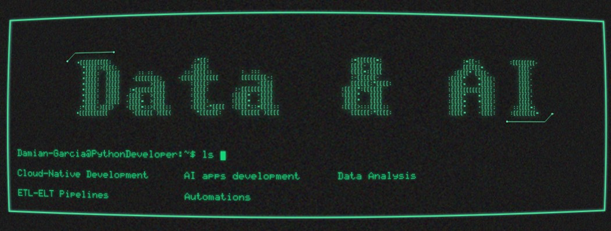

### Hola mundo, I'm Damián 👋

## I'm a Python Developer with a passion for Data and Responsible AI.

- 🌱 Currently diving deep into AI Engineering, honing skills to build transformative systems.
- 🌐 Skilled in Azure Cloud solutions, leveraging its services for efficient deployments.
- 🥅 2025 Goals: Master crafting responsible AI systems that empower individuals to achieve the extraordinary.
- ⚡ Fun fact: I'm passionate about calisthenics - it's my way of building both body and mind!

## 🌐 Socials:
 

# 💻 Tech Stack:
                                  
